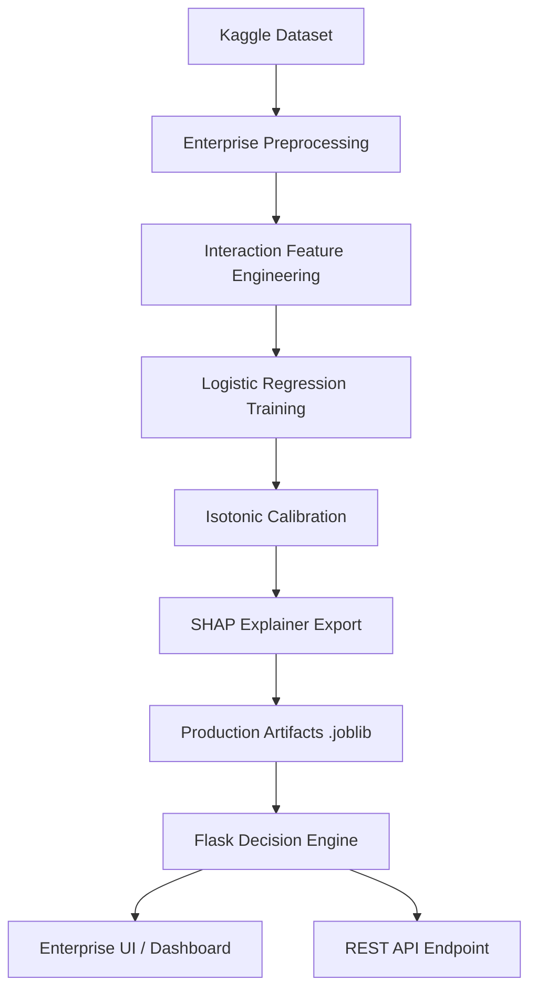
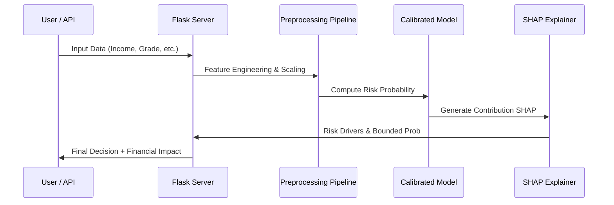
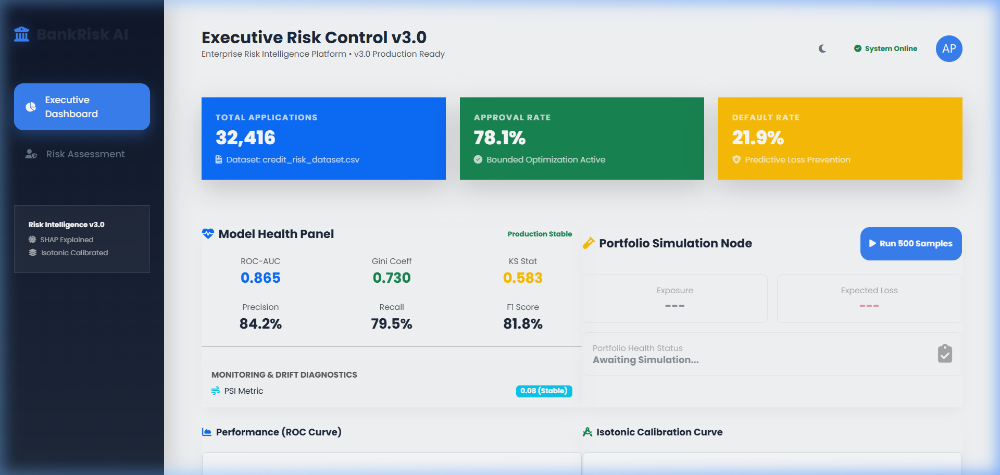
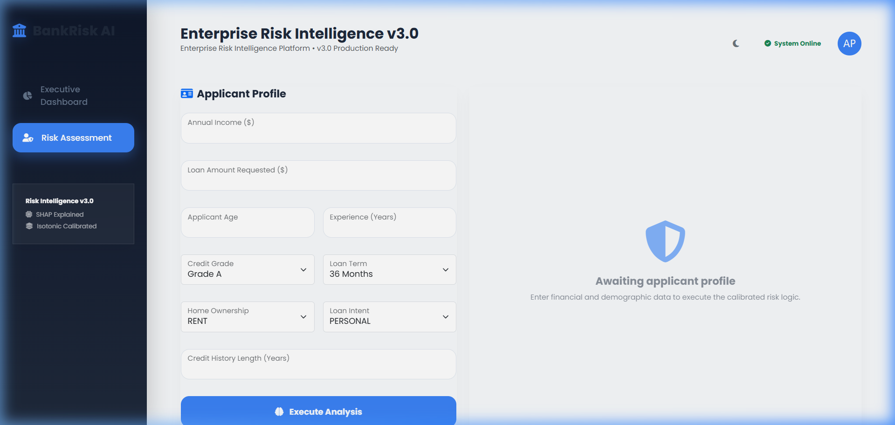
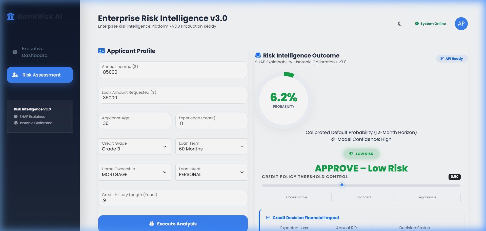
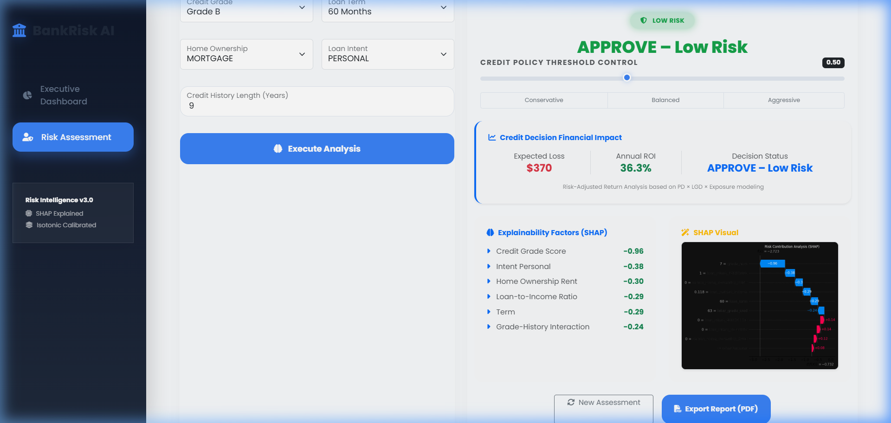

# BankRisk Intelligence™ — Enterprise Risk Platform (v3.0)

A production-grade credit risk intelligence engine that provides automated decisioning, SHAP-based explainability, and portfolio-level financial strategy.

## How to Run the Project

### 1. Prerequisites
Ensure you have Python 3.9+ installed. Install the enterprise stack:

```powershell
pip install pandas numpy seaborn matplotlib scikit-learn joblib shap flask
```

### 2. Run the Full Backend Pipeline
You can run the entire backend processing (Data Cleaning -> EDA -> Modeling) using:

```powershell
python main.py
```

### 3. Run the Flask Web Application
To launch the professional web interface:

```powershell
python app.py
```
Then open your browser and navigate to `http://127.0.0.1:5000`.

### 4. Individual Steps (Optional)
If you wish to run steps individually:

- **Step 1: Data Cleaning**
  ```powershell
  python data_cleaning.py
  ```
  *Output: `cleaned_credit_risk.csv`*

- **Step 2: Exploratory Data Analysis**
  ```powershell
  python eda.py
  ```
  *Output: Visualizations in `eda_plots/` folder*

## Model Architecture (Enterprise v3.0)

### Technical Specification
- **Engine**: Logistic Regression (Regularized C=0.01)
- **Calibration**: Isotonic (Smooth Probability Distribution)
- **Bounding**: 0.01 – 0.985 (Risk Buffer)
- **Features**: Interaction Terms (Grade × Credit Tenure), Loan Term Factor (36/60), Experience Ratio.
- **Explainability**: SHAP (Shapley Additive Explanations)

### High-Level Architecture


### Data Flow (Individual Prediction)


## REST API Integration

### `POST /api/predict`
**Request Body:**
```json
{
  "age": 35,
  "income": 120000,
  "loan_amount": 45000,
  "emp_length": 12,
  "grade": "B",
  "cred_hist": 15,
  "loan_term": 60
}
```

**Response:**
```json
{
  "probability": 0.4215,
  "risk_tier": "MEDIUM",
  "decision": "REVIEW",
  "expected_loss": 11380.5,
  "version": "Enterprise v3.0"
}
```

## Application Screenshots

Here is a preview of the Master Enterprise v3.0 platform in action:

### Executive Dashboard (Portfolio Overview)


### Risk Assessment Tool (Input Form)


### Risk Assessment Tool (Decision & Probability Breakdown)


### SHAP Explainability & Financial Intelligence


## Project Outputs
- **Explainability**: `shap_explainer.joblib` & `latest_shap.png`
- **Dashboards**: `Executive Dashboard` (Portfolio Stats) & `Risk Assessment Tool` (Individual Drilldown)
- **Metrics**: `roc_curve.png`, `confusion_matrix.png`, `model_stats.joblib`

## Power BI Dashboard
Load `final_loan_risk_results.csv` into Power BI to create the executive dashboard as described in the project walkthrough.
